<!-- HEADER -->
<div align="center">
  
</div>

<br/>

<!-- TYPING ANIMATION -->
<div align="center">
  <a href="https://git.io/typing-svg"></a>
</div>

<br/>

<!-- SOCIAL BADGES ROW -->
<div align="center">
  <a href="https://www.linkedin.com/in/aditya-prakash-36792a375"></a>&nbsp;
  <a href="mailto:adityaorinal@gmail.com"></a>&nbsp;
  <a href="https://github.com/aditya-dev06"></a>&nbsp;
  
</div>

<br/>

<!-- ABOUT ME -->
##  &nbsp;About Me

```yaml
name: Aditya Prakash
located_in: India
education: B.Tech in CSE (Data Science Specialization)
current_focus:
  - "🧠 AI / Machine Learning"
  - "📊 Data Science & Analytics"
  - "⚙️ DevOps & Infrastructure Automation"
  - "✨ Prompt Engineering & LLM Orchestration"

strengths: ["Python", "C++", "Prompt Engineering", "Data Visualization"]
currently_learning: ["Docker", "CI/CD Pipelines", "Neural Networks", "Distributed Training"]
fun_fact: "I can prompt-engineer an AI faster than I can cook instant noodles 🍜"
```

<br/>

<!-- TECH STACK -->
## 📚 &nbsp;Currently Learning & Building With

> 🌱 *These are the technologies I'm actively learning and exploring as part of my journey in Data Science, AI/ML, and DevOps.*

<details open>
<summary><b>&nbsp;&nbsp;🐍 Learning — Languages & Core</b></summary>
<br/>
<p align="center">
  
  
  
  
  
</p>
</details>

<details open>
<summary><b>&nbsp;&nbsp;🧠 Learning — AI / ML & Data Science</b></summary>
<br/>
<p align="center">
  
  
  
  
  
  
</p>
</details>

<details open>
<summary><b>&nbsp;&nbsp;⚙️ Learning — DevOps & Tools</b></summary>
<br/>
<p align="center">
  
  
  
  
  
</p>
</details>

<br/>

<!-- GITHUB STATS -->
## 📊 &nbsp;GitHub Analytics

<div align="center">
  
  &nbsp;&nbsp;
  
</div>

<br/>

<div align="center">
  
</div>

<br/>

<!-- ACTIVITY GRAPH -->
<div align="center">
  
</div>

<br/>

<!-- AREAS I'M EXPLORING -->
## 🎯 &nbsp;Areas I'm Exploring

<table align="center">
  <tr>
    <td align="center" width="33%">
      <br/>
      <sub><b>Data Science & Analytics</b></sub><br/><br/>
      <sub>Learning to work with<br/>real-world datasets, writing<br/>Python scripts for analysis,<br/>and building visualizations</sub>
    </td>
    <td align="center" width="33%">
      <br/>
      <sub><b>AI & Machine Learning</b></sub><br/><br/>
      <sub>Studying neural networks,<br/>experimenting with ML models<br/>in class projects, and<br/>practicing prompt engineering</sub>
    </td>
    <td align="center" width="33%">
      <br/>
      <sub><b>DevOps & Automation</b></sub><br/><br/>
      <sub>Getting hands-on with<br/>Docker, learning Git workflows,<br/>and exploring CI/CD<br/>and Linux basics</sub>
    </td>
  </tr>
</table>

<br/>

<!-- AUTO-GENERATED: Skills & activity pulled directly from my repos -->
## 📈 &nbsp;My GitHub at a Glance

> 🤖 *These cards are auto-generated from my repositories — as I push more code, they update automatically!*

<div align="center">
  
</div>

<div align="center">
  
  
  
</div>

<br/>

<!-- CURRENTLY WORKING ON -->
## 🚀 &nbsp;What I'm Up To

- 🔭 &nbsp;**Building** — ML models for real-world data prediction tasks
- 🌱 &nbsp;**Deepening** — My expertise in Docker, Kubernetes, and CI/CD automation
- 🤖 &nbsp;**Exploring** — Large Language Models and advanced prompt engineering
- 🎯 &nbsp;**Goal** — Land an impactful internship in AI/ML or Data Engineering
- ⚡ &nbsp;**Fun Fact** — I debug code like a detective solves mysteries 🔍

<br/>

<!-- RANDOM DEV QUOTE -->
## 💭 &nbsp;Dev Quote of the Day

<div align="center">
  
</div>

<br/>

<!-- CONTRIBUTION SNAKE -->
## 🐍 &nbsp;Contribution Snake

<div align="center">
  <picture>
    <source media="(prefers-color-scheme: dark)" srcset="https://raw.githubusercontent.com/aditya-dev06/aditya-dev06/output/github-snake-dark.svg" />
    <source media="(prefers-color-scheme: light)" srcset="https://raw.githubusercontent.com/aditya-dev06/aditya-dev06/output/github-snake.svg" />
    
  </picture>
</div>

<br/>

<!-- CONNECT -->
## 🤝 &nbsp;Let's Connect

<div align="center">
  <p>
    I'm always excited to collaborate on <b>open-source projects</b>, discuss <b>AI/ML research</b>,<br/>
    or chat about <b>data engineering</b> and <b>DevOps best practices</b>!
  </p>

  <a href="mailto:adityaorinal@gmail.com"></a>&nbsp;
  <a href="https://www.linkedin.com/in/aditya-prakash-36792a375"></a>
</div>

<br/>

---

<div align="center">
  <sub>⭐ From <a href="https://github.com/aditya-dev06">aditya-dev06</a> — Built with passion & a lot of ☕</sub>
</div>
